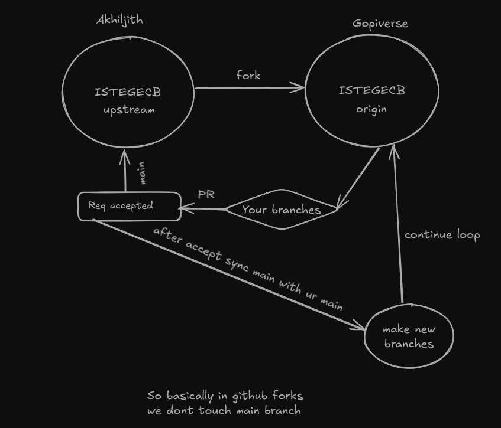

# ISTEGECB

<!-- 
git add .
git commit -m "message"
git push -u origin main

if error on push:
  git pull origin main 
  git push -u origin main  -->


  

  ## Fork Workflow Guide

  ### 1. Initial Setup (One-time only)
  ```bash
  # Add original repository as upstream
  git remote add upstream https://github.com/Akhiljithk/ISTEGECB.git

  # Verify remote repositories
  git remote -v  # Should show both origin and upstream URLs
  ```

  ### 2. Before Starting Work
  ```bash
  # Sync with upstream
  git checkout main
  git fetch upstream
  git merge upstream/main
  git push origin main

  ```

  ### 3. Creating & Working on New Feature
  ```bash
  # Create and switch to new branch
  git checkout -b feature-name

  # Push branch to remote and set upstream
  git push -u origin feature-name
  ```

  ### 4. Making Changes
  ```bash
  # Stage and commit changes
  git add .
  git commit -m "message"
  git push
  ```

  ### 5. After Pull Request Merge
  ```bash
  # Update local main branch
  git checkout main
  git fetch upstream
  git merge upstream/main
  git push origin main
  ```

  ### 6. Cleanup
  ```bash
  # Remove feature branch (OPTIONAL maybe)
  git push origin --delete feature-branch  # Remote cleanup
  git branch -d feature-branch            # Local cleanup
  git branch -D feature-branch            # force delete...
  ```



  